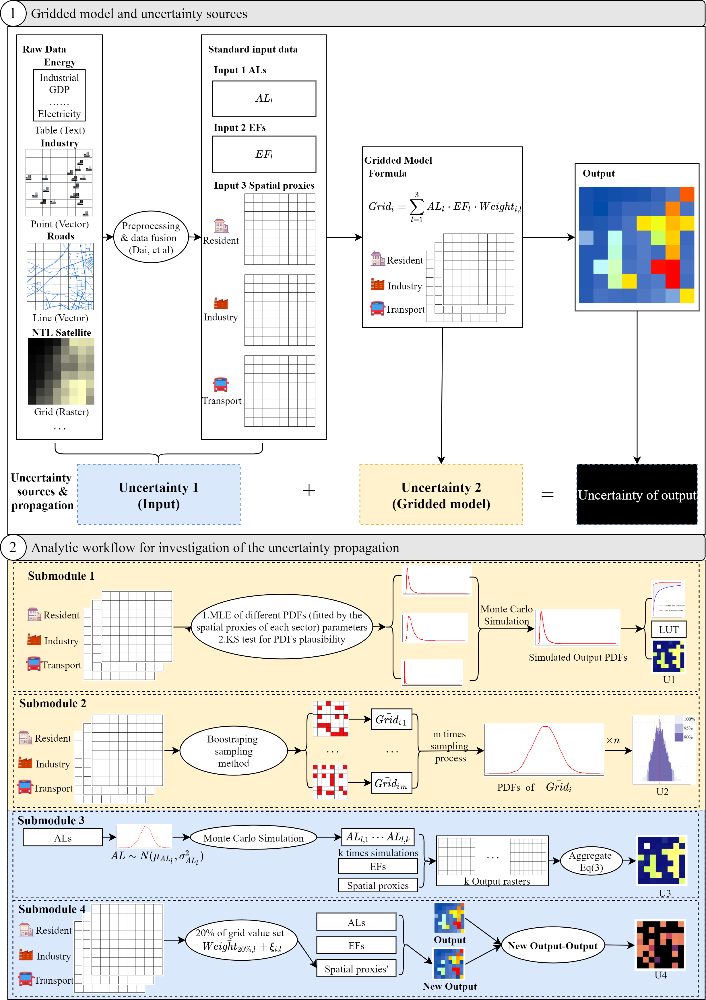

11月30日，戴劭勍等在《遥感》（Remote Sensing）发表题为“城市尺度二氧化碳排放网格制图的不确定性传播分析研究——以中国晋江市为例(Investigating the Uncertainties Propagation Analysis of $CO_2$ Emissions Gridded Maps at the Urban Scale: A Case Study of Jinjiang City, China)”的研究论文。论文基于Monte Carlo模拟与Bootstraping抽样方法构建了一个包含四个子模块的分析工作流，系统地量化了二氧化碳排放网格制图过程中的不确定性。包括由网格化模型，模型输入，以及网格化过程传递导致的不确定性。研究结果揭示了二氧化碳排放网格制图过程中不同部门排放的不确定性，不确定性的空间分布图以及网格化过程传播的不确定性，为决策者建立碳减排目标实现碳中和，设计低碳城市与社区规划政策提供科学依据。

城市在低碳发展中起着至关重要的作用，因为城市容纳了全球一半的人口，消耗了全球四分之三的能源，排出了全球四分之三的温室气体。**了解人为活动产生的二氧化碳的时空分布对于减缓碳排放非常重要。**从多个传感器源获取的地理空间数据集（如，遥感卫星，众包数据，基于位置服务的的数据与传感器数据）数量正在大幅增加，这使得精确定量化二氧化碳排放的时空动态成为可能。**然而，城市尺度的二氧化碳排放估算具有巨大的不确定性，从而影响减排政策的执行效率。**

目前科学家们对城市尺度二氧化碳排放制图数据输入导致的不确定性估算有较多研究，并且将数据输入的不确定性划分为两个主要的来源：由于总排放估计造成的不确定性和由于时空代理变量造成的不确定性。但是较少研究关注网格化模型造成的不确定性。同时这些不同来源的不确定性通过格网化过程传播到最终的制图结果后的变化仍然是未知的。由于大部分城市缺乏详细的城市二氧化碳排放清单，通用的不确定性评估方法——清单比较法往往无法实现，因此亟需提出更为有效定量化二氧化碳排放网格制图的不确定性的方法。

在此背景下，本文提出了一种可重复的分析工作流分析由网格化模型和模型输入引起并传播到制图结果的不确定性且无需其他任何详细的公开排放清单。

## 工作流

工作流的四个子模块基于两个基本假设：（1）模型输入是真实数据且未引起不确定性；（2）网格化模型未引起不确定性。本文基于假设1开发了前两个子模块（子模块1和2）。在这些子模块中，输出的不确定性仅取决于网格化模型和不确定性传播所引起的不确定性。此外，本文基于假设2开发了其他子模块（子模块3和4）。在这些子模块中，输出的不确定性仅取决于由输入和不确定性传播引起的不确定性。 输入可以分为两个详细的分类：总排放估算和空间代理。 子模块3和4旨在分别研究由总排放量估算和空间代理引起的上述相应不确定性。这里本文以中国南方的晋江市，一个典型的中小城市为例，基于该城市构建的两套不同分辨率（30米和500米）的二氧化碳排放网格图，应用工作流分析制图过程中的不确定性。

## 网格化模型引起的不确定性

从累积分布函数曲线与95%置信区间结果来看，住宅部门二氧化碳排放的不确定性最小，交通运输部门二氧化碳排放的不确定性稍大于住宅部门，工业生产部门二氧化碳排放的不确定性最大。500米分辨率网格图的不确定性更大。同时不确定性随着像元值增大而逐渐减小，但变化幅度因分辨率/尺度不同而异。而网格化模型引起的不确定性空间分布图显示，大部分不确定性达到100%的像元对应的二氧化碳排放值为0。而其余像元的不确定性均小于50%。同时总排放的不确定性与三个部门不确定性之和的关系并非是简单的线性叠加，总排放的不确定性小于三个部门不确定性之和。

## 模型输入引起的不确定性

总排放量估算造成的不确定性经过制图模型传播的实验结果表明总排放的不确定性均小于每个部门的不确定性。同时从空间分布图来看，研究区中间工业区和东北建成区的不确定性都较小（不确定度低于30％）。研究区北部体现了由于尺度造成的不确定性变异，500米分辨率网格图中不确定性较低的较大区域在30 米分辨率网格图中具有较高的不确定性。低不确定性的像元在30米网格图中离散分布，而在500米网格图中呈连续分布。

空间代理变量遭横的不确定性经过制图模型传播的实验结果表明即使输入的空间代理变量均设置了20%的随机误差，但是经过制图模型传播，不确定性虽然均大于20%，但同时也小于几个空间代理变量误差的累加和。呈现了一个非线性变化的趋势，同时由于空间代理变量的误差，大部分区域会高估排放量，且高排放强度的城市地区和工业地区误差会更大。

## 讨论与结论

### 不确定性

总排放的不确定性与三个部门不确定性之和的非线性关系说明了不确定性在模型传播过程中存在“随机误差补偿”机制，即同一个像元上不同输入变量的高估值与低估值实现了一定程度的抵消，降低了该像元模型结果的总不确定性。两个尺度不确定性结果的对比表明，尽管细尺度数据提供了更多的信息，但是可能存在更大的不确定性，即不同尺度的不确定性可能与二氧化碳排放的空间变异程度是相关的。最后，本研究中提出的不确定性传播分析工作流程可能有助于决策者设计合适的低风险策略。

### 推荐的未来研究方向

- 先进的对地观测卫星与相关技术可以实现精确与高分辨率的定量化二氧化碳地图。二氧化碳网格地图可以基于新的夜间灯光遥感卫星与温室气体卫星进行估算。

- 碳通量监测数据与大气模型的耦合对于开发自下而上的空间显式二氧化碳排放估算模型至关重要。

- 数据同化技术可以实现卫星观测数据与大气海洋模型输出数据的融合。

**文章信息：**

Dai, S.; Ren, Y.; Zuo, S.; Lai, C.; Li, J.; Xie, S.; Chen, B. Investigating the Uncertainties Propagation Analysis of CO2 Emissions Gridded Maps at the Urban Scale: A Case Study of Jinjiang City, China. Remote Sens. 2020, 12, 3932.

**网站介绍：**

http://science.gisersqdai.top/RSunco2/rsbrief.html

**公开数据集：**

Dai S, Zuo S, Ren Y. 2019. GISerDaiShaoqing/Urban-Carbon-Dioxide-sources-gridded-maps-and-its-detemination-in-Jinjiang-city 0.6.; doi:10.5281/zenodo.3566072.

