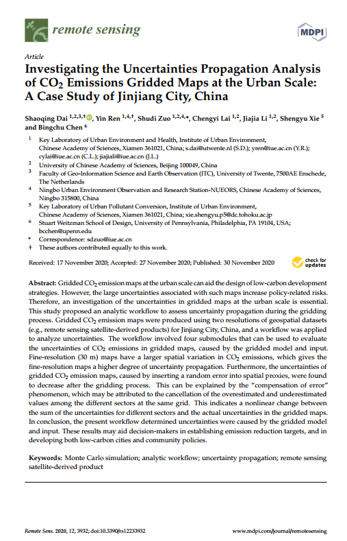
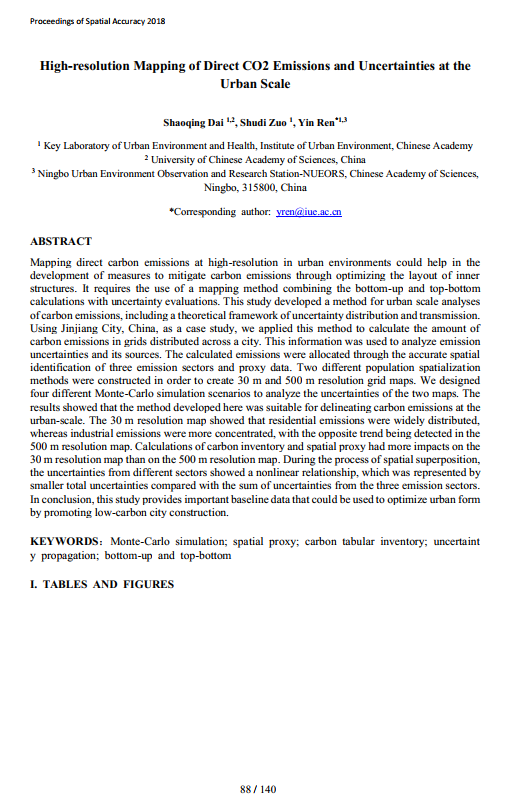
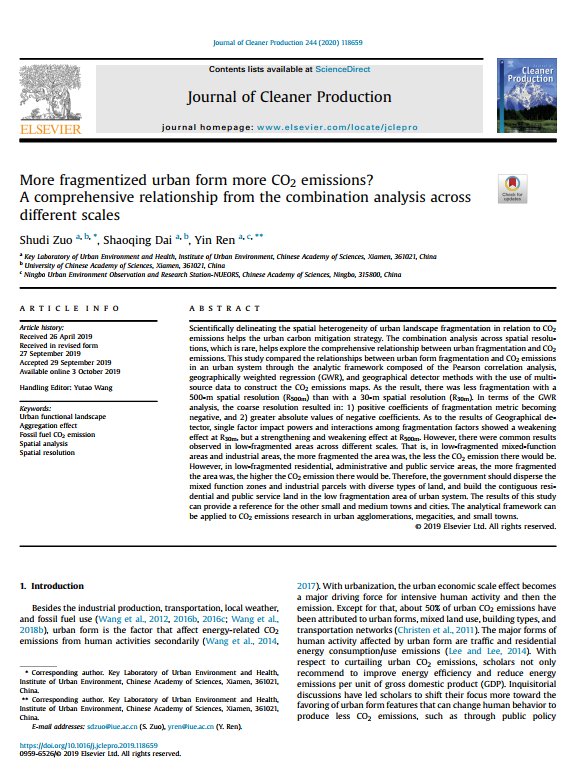
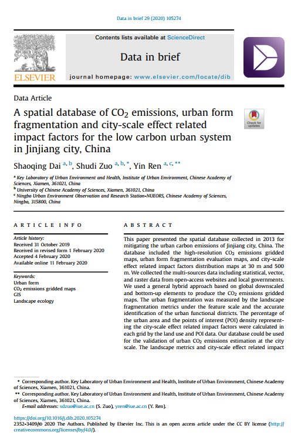

**[[Paper]](https://www.mdpi.com/2072-4292/12/23/3932)**
**[[GitHub]](https://github.com/GISerDaiShaoqing/manuscript_co2_gridded_uncertainty_RS)**

---------------

## Graphical abstract


---------------

## Abstract

Gridded CO$_2$ emission maps at the urban scale can aid the design of low-carbon development strategies. However, the large uncertainties associated with such maps increase policy-related risks. Therefore, an investigation of the uncertainties in gridded maps at the urban scale is essential. This study proposed an analytic workflow to assess uncertainty propagation during the gridding process. Gridded CO$_2$ emission maps were produced using two resolutions of geospatial datasets (e.g., remote sensing satellite-derived products) for Jinjiang City, China, and a workflow was applied to analyze uncertainties. The workflow involved four submodules that can be used to evaluate the uncertainties of CO$_2$ emissions in gridded maps, caused by the gridded model and input. Fine-resolution (30 m) maps have a larger spatial variation in CO$_2$ emissions, which gives the fine-resolution maps a higher degree of uncertainty propagation. Furthermore, the uncertainties of gridded CO$_2$ emission maps, caused by inserting a random error into spatial proxies, were found to decrease after the gridding process. This can be explained by the “compensation of error” phenomenon, which may be attributed to the cancellation of the overestimated and underestimated values among the different sectors at the same grid. This indicates a nonlinear change between the sum of the uncertainties for different sectors and the actual uncertainties in the gridded maps. In conclusion, the present workflow determined uncertainties were caused by the gridded model and input. These results may aid decision-makers in establishing emission reduction targets, and in developing both low-carbon cities and community policies.

---------------

## Talk

The 13th International Symposium on Spatial Accuracy Assessment in Natural Resources and Environmental Sciences(Spatial Accuracy 2018).


[[Slides]](http://gisersqdai.top/mycv/201807slides.pdf)

---------------

## Analytic workflow

Our goal was to quantify the uncertainties caused by the gridded model, and inputs of the gridded CO$_2$ emission maps at the urban scale. We proposed an analytic workflow based on the Monte Carlo simulation and bootstrap sampling method. 


---------------

## Datasets and visualization

### Brief

We assessed the uncertainty of CO$_2$ emissions gridded maps during the gridded proceess using our proposed analytic workflow.[@rs12233932] These generated uncertainty maps were available on the [Zenodo](https://doi.org/10.5281/zenodo.3566072)[@shaoqing_dai_2019_3566073].

The download links of these datasets was shown as follow.

#### U1-caused by gridded model

30 m:
[Total](http://science.gisersqdai.top/RSunco2/U1_30_total.tif) [Resident](http://science.gisersqdai.top/RSunco2/U1_30_res.tif) [Industry](http://science.gisersqdai.top/RSunco2/U1_30_ind.tif) [Transport](http://science.gisersqdai.top/RSunco2/U1_30_trans.tif)

500 m:
[Total](http://science.gisersqdai.top/RSunco2/U1_500_total.tif) [Resident](http://science.gisersqdai.top/RSunco2/U1_500_res.tif) [Industry](http://science.gisersqdai.top/RSunco2/U1_500_ind.tif) [Transport](http://science.gisersqdai.top/RSunco2/U1_500_trans.tif)

#### U3-caused by activity levels

[30m](http://science.gisersqdai.top/RSunco2/U3_30.tif) [500m](http://science.gisersqdai.top/RSunco2/U3_500.tif)

#### U4- caused by spatial proxies

[30m](http://science.gisersqdai.top/RSunco2/U4_30.tif) [500m](http://science.gisersqdai.top/RSunco2/U4_500.tif)

### Visualization

- Uncertainty maps

```{r echo=FALSE, message=FALSE, warning=FALSE}
library(leaflet)
library(raster)
library(RColorBrewer)

co30 <- raster('F:/GISproject/IUE/CarbonEmission/DIBdata/webpage/dataset/CO30.tif')
u130 <- raster('F:/GISproject/IUE/CarbonEmission/DIBdata/webpage/dataset/U1_30_total.tif')
u330 <- raster('F:/GISproject/IUE/CarbonEmission/DIBdata/webpage/dataset/U3_30.tif')
u430 <- raster('F:/GISproject/IUE/CarbonEmission/DIBdata/webpage/dataset/U4_30.tif')

pal1 <- colorNumeric(c("YlOrRd"), na.omit(values(co30)))
pal2 <- colorNumeric(c("viridis"), na.omit(values(u130)))
pal3 <- colorNumeric(c("viridis"), na.omit(values(u330)))
pal4 <- colorNumeric(c("RdBu"), na.omit(values(u430)))

leaflet() %>%
  addProviderTiles(providers$CartoDB.DarkMatter, group="Dark") %>%
  addRasterImage(co30, colors = pal1, group = 'Carbion dioxide emissions (t)') %>%
  addRasterImage(u130, colors = pal2, group = 'U1 (%)') %>%
  addRasterImage(u330, colors = pal3, group = 'U3 (%)') %>%
  addRasterImage(u430, colors = pal4, group = 'U4 (t)') %>%
  addLegend("bottomright", pal = pal1, values = values(co30),
            title = "Total emissions (t)", group = "Carbion dioxide emissions (t)") %>%
  addLegend("bottomleft", pal = pal2, values = values(u130),
            title = "U1 (%)", group = "U1 (%)")%>%
  addLegend("bottomleft", pal = pal3, values = values(u330),
            title = "U3 (%)", group = "U3 (%)") %>%
  addLegend("bottomleft", pal = pal4, values = values(u430),
            title = "U4 (t)", group = "U4 (t)")%>%
  addLayersControl(baseGroups = c("Dark"),
                   overlayGroups = c('Carbion dioxide emissions (t)', 'U1 (%)', 'U3 (%)', 'U4 (t)'),
                   options = layersControlOptions(collapsed = TRUE)
                   ) 

```

- Uncertainty plot and table

```{r echo=FALSE, message=FALSE, warning=FALSE}
library(plotly)
library(ggplot2)

rmc30all <- read.csv('data/rmc30.csv')
polyx <- read.csv('data/polyx.csv')
polyy <- read.csv('data/polyy.csv')

fign <- ggplot(rmc30all) + 
  geom_polygon(mapping = aes(x = polyx$x, y = polyy$x), fill="#EEEEEE", alpha = 0.7) + 
  geom_point(mapping = aes(x = gridvalue, y = CDF, colour = type)) + 
  geom_line(mapping = aes (x = gridvalue, y = CDF, colour = type)) +
  scale_color_manual(values = c("blue", "red")) +  
  scale_x_continuous(breaks = c(0, 500, 1000,1500,2000),
                     labels = c("0","500","1,000","1,500","2,000")) + 
  labs(x = 'Grid value (t)', y ='Cumulative Probability', title = '', colour = "") + 
  theme(panel.background = element_blank(),
        panel.border = element_rect(colour = 'black', fill = NA, size = 1.2),
        legend.key.size = unit(2, "cm"),
        legend.position='top',
        legend.title=element_text(family="RT",size=12,colour="black"),
        legend.text=element_text(family="RT",size=12,colour="black"),
        title=element_text(size=12,family="RT"),axis.text.y=element_text(size=12,family="RT"),
        axis.text.x=element_text(size=12,family="RT"),axis.title=element_text(size=12,family="RT"),
        strip.text=element_text(size=12,family="RT"))

fig <- ggplotly(fign)
fig
```

Table Uncertainty in $CO_2$ emissions (x $10^3$ t) from different sectors from the 30 m and 500 m resolution maps

```{r echo=FALSE, message=FALSE, warning=FALSE}
library(colorTable)
tdf <- data.frame(sector = c('Resident', 'Industry', 'Transport', 'Total'),
                  Confidence_Interval_95_30 = c('2304 to 2970\n(-11% to +14%)',
                               '9744 to 18170\n(-29% to +32%)',
                               '240 to 357\n(-19% to +20%)',
                               '12289 to 21498\n(-26% to +29%)'),
                  Confidence_Interval_95_500 = c('2401 to 2799\n(-8% to +8%)',
                                '11917 to 15591\n(-13% to +14%)',
                                '274 to 323\n(-8% to +8%)',
                                '14593 to 18714\n(-12% to +13%)'),
                  Uncertainty_30 = c('12.84%',
                                     '30.62%',
                                     '19.67%',
                                     '27.65%'),
                  Uncertainty_500 = c('7.68%',
                                     '13.38%',
                                     '8.19%',
                                     '12.40%'))
color_table(tdf, col_bgs = c('#eaffd0', '#fce38a', '#fce38a', '#f38181', '#f38181'))
```


---------------

## Paper and Supplementary material


{width=160px height=250px}{width=160px height=250px}{width=160px height=250px}{width=160px height=250px}

[[Bibtex]](https://github.com/GISerDaiShaoqing/manuscript_co2_gridded_uncertainty_RS/raw/master/bibtex.txt)

---------------

## Reference
